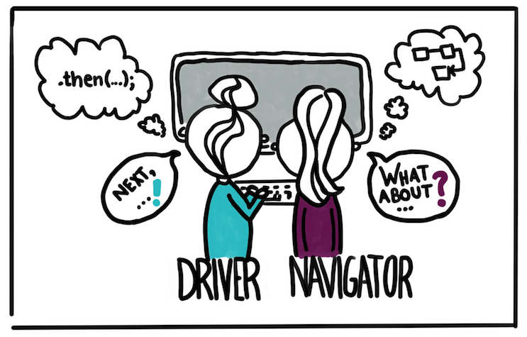
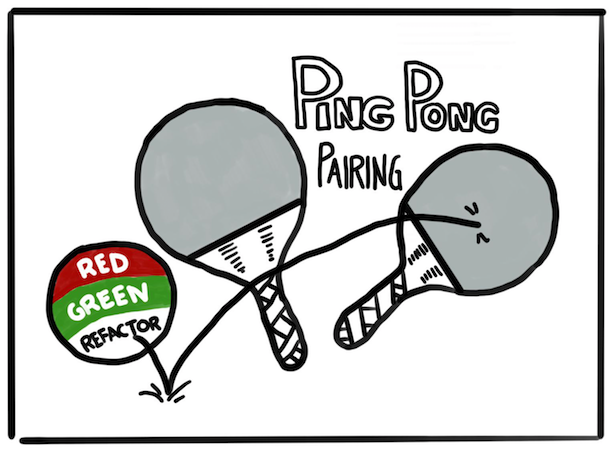

# Pair Programming

## Objective

The objective is to have one or multiple sessions to get everyone on the collaboration team ready to use pair programming to effectively collaborate.

## Format

- one Teams call with multiple sessions: One for each pair
- each pair gets a challenge and a combined practice to adapt
- after every session, we come together and share our outcomes
- in the next session, driver/navigators are switched
- one session of 30min per day for 3 days in 3 consecutive weeks (1st session with intro: total ~45min)

## Additional Tools

- [Visual Studio Live Share](https://marketplace.visualstudio.com/items?itemName=MS-vsliveshare.vsliveshare)

## Mindset

Before jumping straight into the code, make sure you take the following things into consideration:

### 1. Understand the problem

- read trough the story
- discuss with your peer how you understand it
- if anything is unclear, contact your Product Owner to answer open questions
- make sure the pair has everything to get started

### 2. Define the solution

- make sure to share information to come to a similar level of understanding of the domain
- come up with possible solutions for the challenge (together or individually)

### 3. Plan the approach

- define steps (for User Stories these could be Tasks) together to meet the Acceptance criteria
- define testing strategy
- write down all steps as you define them

## Styles to learn

### Driver and Navigator

> from [Martin Fowlers - On Pair Programming](https://martinfowler.com/articles/on-pair-programming.html)

The **Driver** is the person at the wheel, i.e. the keyboard. She is focussed on completing the tiny goal at hand, ignoring larger issues for the moment. A driver should always talk through what she is doing while doing it.

The **Navigator** is in the observer position, while the driver is typing. She reviews the code on-the-go, gives directions and shares thoughts. The navigator also has an eye on the larger issues, bugs, and makes notes of potential next steps or obstacles.

### Ping Pong

> from [Martin Fowlers - On Pair Programming](https://martinfowler.com/articles/on-pair-programming.html)

This technique embraces Test-Driven Development (TDD) and is perfect when you have a clearly defined task that can be implemented in a test-driven way.

"Ping": Developer A writes a failing test
"Pong": Developer B writes the implementation to make it pass.
Developer B then starts the next "Ping", i.e. the next failing test.
Each "Pong" can also be followed by refactoring the code together, before you move on to the next failing test. This way you follow the "Red - Green - Refactor" approach: Write a failing test (red), make it pass with the minimum necessary means (green), and then refactor.

### Strong-Style Pairing

- similar to driver/navigator
- the more experienced person for the task is the navigator
- the other person is the driver
- the navigator guides the novice through the task

The rule: "For an idea to go from your head into the computer it MUST go through someone else's hands". In this style, the navigator is usually the person much more experienced with the setup or task at hand, while the driver is a novice (with the language, the tool, the codebase, ...). The experienced person mostly stays in the navigator role and guides the novice.

An important aspect of this is the idea that the driver totally trusts the navigator and should be "comfortable with incomplete understanding". Questions of "why", and challenges to the solution should be discussed after the implementation session. In a setting where one person is a total novice, this can make the pairing much more effective.

While this technique borders on micro-management, it can be a useful onboarding tool to favor active "learning by doing" over passive "learning by watching". This style is great for initial knowledge transfer, but shouldn't be overused. Keep in mind that the goal is to be able to easily switch roles after some time, and ease out of the micro management mode. That will be a sign that the knowledge transfer worked.

## Challenges

To test out the different pair-programming styles, we define pairs of 2 people and solve the following challenges. The time for each challenge is 20 minutes.

After each challenge the team comes back to the larger group and shares their feedback (in standup style) on:

1. How did that pp-style work for your pair? (Pros and cons)
1. Was this style the right choice for your task?
1. Did you meet your defined goal?

After all challenges, we comes together and discuss the 3 styles.

### Challenge 1

Challenge 1 is all about implementing the Two-Fer functionality with the Driver-Navigator approach to pair programming. Details can be found in the [session 1 readme](sessions/session_1/README.md)

### Challenge 2

Challenge 1 is about implementing a leap year check with the Ping Pong approach to pair programming. Details can be found in the [session 2 readme](sessions/session_2/README.md)

## Further Reading

- [On Pair Programming](https://martinfowler.com/articles/on-pair-programming.html#Styles)
- [Strong Style Pairing](https://llewellynfalco.blogspot.com/2014/06/llewellyns-strong-style-pairing.html)
- [Test Driven Development](https://martinfowler.com/bliki/TestDrivenDevelopment.html)
